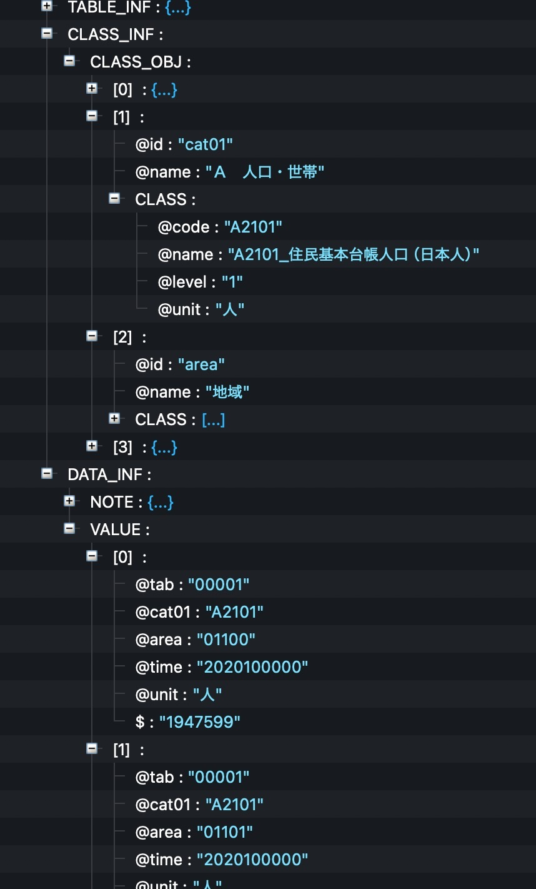
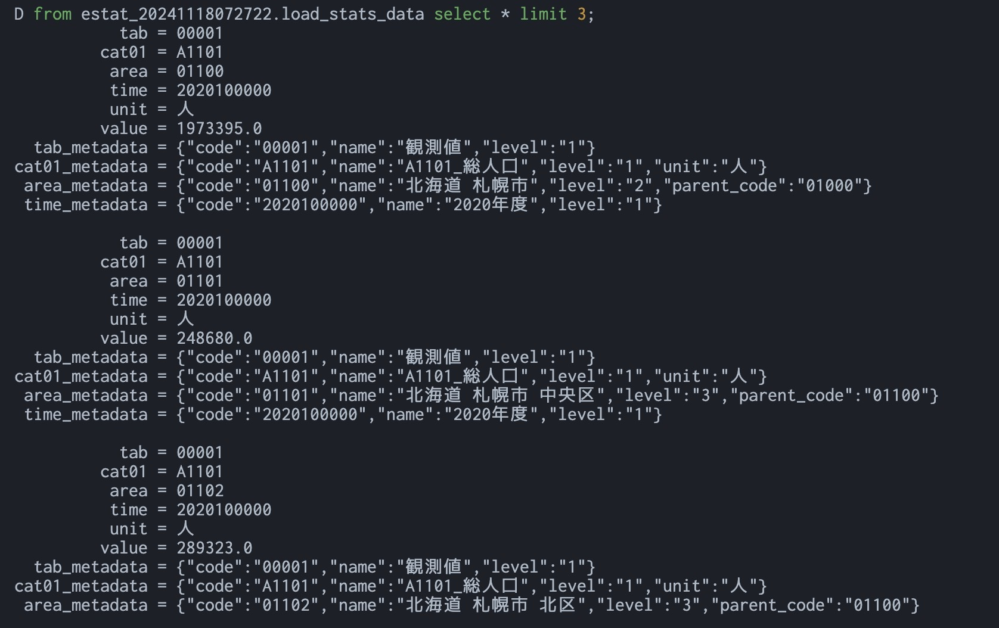

# estat_api_dlt_helper

[](https://opensource.org/licenses/MIT)
[](https://www.python.org/downloads/)

[e-Stat API](https://www.e-stat.go.jp/api/)からデータを取得しロードするhelper

## 概要

e-Stat APIを利用してデータを取得し、DWHなどのデータ基盤にロードするシーンでの活用を想定しています。

Pythonのライブラリとして動作し、以下の２つの機能を提供します。

- `parse_response`
  - APIのレスポンスをパースし、データとメタデータを結合させたArrow Tableを作成します。
- `load_estat_data`
  - [dlt(data load tool)](https://dlthub.com/docs/intro)のラッパーとして動作し、
    統計表IDとテーブル名などを設定するだけで、簡単にDWHなどにロード可能です。
  - paginationや複数の統計表IDを同じテーブルにロードしたいケースなどを内部でいい感じに処理します。

## インストール

```bash
pip install estat_api_dlt_helper

# BigQuery
pip install "estat_api_dlt_helper[bigquery]"

# Snowflake
pip install "estat_api_dlt_helper[snowflake]"

# duckdb
pip install "estat_api_dlt_helper[duckdb]"
```

## 使用方法

e-Stat APIに関して、ユーザー登録やアプリケーションIDの取得が完了している前提です。
取得したアプリケーションIDは環境変数に入れておいてください。

```bash
export ESTAT_API_KEY=YOUR_APP_ID
```

Win: 

```
$env:ESTAT_API_KEY = "YOUR_APP_ID"
```

### parse_responseの使い方

e-Stat APIの`/rest/3.0/app/json/getStatsData`のレスポンスを`parse_response()`に渡すことで、
responseの`TABLE_INF.VALUE`の中身をテーブルとして、`CLASS_INF.CLASS_OBJ`の中身をメタデータとして名寄せさせたArrow Tableを生成することができます。

処理イメージ:

| response                                | 加工後                                 |
| --------------------------------------- | -------------------------------------- |
|  |  |

see: [examples](examples/basic_parser_usage.py)

```python
import os
import pandas as pd
import requests

from estat_api_dlt_helper import parse_response

# API endpoint
url = "https://api.e-stat.go.jp/rest/3.0/app/json/getStatsData"

# Parameters for the API request
params = {
    "appId": os.getenv("ESTAT_API_KEY"),
    "statsDataId": "0000020201",  # 社会人口統計 市区町村データ 基礎データ
    "cdCat01": "A2101",           # 住民基本台帳人口（日本人）
    "cdArea": "01100,01101",      # 札幌市, 札幌市中央区
    "limit": 10
}
try:
    # Make API request
    response = requests.get(url, params=params)
    response.raise_for_status()
    data = response.json()
    # Parse the response into Arrow table
    table = parse_response(data)
    # Print data
    print(table.to_pandas())

except requests.RequestException as e:
    print(f"Error fetching data from API: {e}")
except Exception as e:
    print(f"Error processing data: {e}")
```

### load_estat_dataの使い方

[dlt(data load tool)](https://dlthub.com/docs/intro)のwrapperとして簡便なconfigで取得データを
DWH等にロードできます。

ロード可能なDWHについては[dltのドキュメント](https://dlthub.com/docs/dlt-ecosystem/destinations/)を参考にしてください。

see: [examples](examples/basic_load_example.py)

```python
# duckdbの場合
import os
import dlt
import duckdb
from estat_api_dlt_helper import EstatDltConfig, load_estat_data

db = duckdb.connect("estat_demo.duckdb")

# Simple configuration
config = {
    "source": {
        "app_id": os.getenv("ESTAT_API_KEY"), #(必須項目)
        "statsDataId": "0000020201",  # (必須項目) 人口推計
        "limit": 100,  # (Optional) Small limit for demo
    },
    "destination": {
        "pipeline_name": "estat_demo",
        "destination": dlt.destinations.duckdb(db),
        "dataset_name": "estat_api_data",
        "table_name": "population_estimates",
        "write_disposition": "replace",  # Replace existing data
    },
}
estat_config = EstatDltConfig(**config)

# Load data with one line
info = load_estat_data(estat_config)
print(info)
```

### parse_responseの使い方 (Advanced)

`load_estat_data()`は簡単な設定でロードを可能にしますが、dltの細かい設定や機能を使いこなしたい場合(`dlt.transform`や`bigquery_adapter`など)は、
dltのresourceとpipelineをそれぞれ単体で生成し、既存のdltのコードと同じように扱うこともできます。

see: [examples (resource)](examples/resource_example.py)

see: [examples (pipeline)](examples/pipeline_example.py)

## Development

```bash
# Install development dependencies
uv sync

# Run tests
uv run pytest

# Format code
uv run ruff format src/
```
